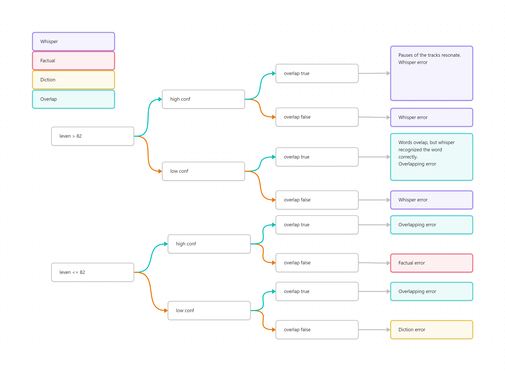

# Детектор ошибок

## Описание

### Общие сведения

Данный модуль предназначен для обнаружения ошибок в аудиофайлах. На вход подаются аудиофайл и текст, который был произнесён
в этом аудиофайле. Модуль определяет ошибки в аудиофайле, классифицирует их, указывает их временные метки и предоставляет
вариант исправления исходя из сравнения текста и аудиофайла.

### Обоснование необходимости

Данный модуль необходим для автоматизации процесса обнаружения ошибок в аудиофайлах. Он позволяет ускорить процесс обработки
аудиофайлов и уменьшить вероятность человеческой ошибки.

### Проблемы, которые решает модуль

Процесс отслушки аудиофайлов и сравнения их с текстом является трудоёмким и требует большого количества времени.
Данный модуль позволит сократить количество контрольных прослушиваний и уменьшить вероятность пропуска ошибок.

## Архитектура

### Описание логики поиска ошибок и их классификации

После некоторых подготовительных действий (приведение к одному регистру, удаление всех символов кроме букв, цифр и пробелов), которые нужны для более точного сравнения, мы производим разбиение оригинальной и транскрибированной строк на токены (слова). Введём обозначения:
$A := [A_1, A_2, …, A_N], B := [B_1, B_2, ..., B_N]$ — массивы слов транскрибированной строки и оригинальной строк соответственно.

$a := [A_{i_1}, A_{i_1+1}, …, A_{i_2}], b := [B_{j_1}, B_{j_1+1}, …, B_{j_2}]$ — подмассивы массивов $A$ и $B$  соответственно.

С помощью функции get_opcodes мы получаем соответствия $а \rightarrow b$, которые установлены таким образом, чтобы из $A$ получилась $B$. Для каждой пары подмассивов мы получаем один из четырёх вариантов операции, которую нужно сделать, чтобы из $A$ получить $B$:
1. equal: $a$ совпадает с $b$
2. insert: В $A$ надо вставить $b$ (В этом случае длина $a$ равна 1)
3. delete: Из $A$ надо надо удалить $a$ (В этом случае длина $b$ равна 1)
4. replace: $a$ надо заменить на $b$

Все пункты кроме первого указывают на наличие ошибок.

В моём рассмотрении я идентифицирую четыре вида ошибок в аудиофайле:
1. Потеряшки (MISSING)
2. Дубликаты (DUPLICATE)
3. Наложения (OVERLAPPING)
4. Фактические (FACTUAL)
5. Дикционные (DICTION)

Сразу установить тип ошибки можно только в случае insert, что, очевидно является потеряшкой. Случай delete даёт два варианта: если $a$ содержится в $A$ больше одного раза, то это дубликат, иначе это фактическая ошибка (диктор произнёс лишние слова). И, самый сложный случай replace требует сравнивать слова из $a$ и $b$ попарно. В нём возникает большая вариативность, для уточнения которой я пользуюсь тремя критериями:
1. Нормированное расстояние Левенштейна (минимальное количество операций по замене, добавлению и удалению букв, которые надо совершить с первым словом, чтобы получить из него второе) между парой соответствующих слов (одно принадлежит $a$, другое $b$) (leven)
2. Уверенность Whisper'а в его транскрипции данного слова (confidence)
3. Моё предположение насчёт того, принадлежит ли данное слово промежутку аудиофайла, в котором есть наложение звука (overlap)

Для значения leven произведена нормировка на число 100. То есть чем ближе значение к 100, тем меньше слова отличаются друг от друга, при значении 100 они полностью совпадают. Я условно считаю слова достаточно похожими для всех значений выше 82.

Чтобы придать второму критерию количественную характеристику, я считаю среднее значение confidence при усреднении по $A$ и также стандартное отклонение confidence. Я предполагаю, что confidence низкий, если он ниже некоторого порога, в качестве которого я взял среднее значение минус стандартное отклонение, домноженное на условный параметр (я взял 3).

Третий критерий конструируется следующим образом: я анализирую искомый аудиофайл, условно деля его на промежутки непрерывной тишины и непрерывного голоса. Считаю среднюю длину промежутков голоса и их стандартное отклонение. Я предполагаю, что те интервала аудиофайла, в которых голос непрерывен, а их длина намного длиннее, чем средняя по файлу, как раз и являются интервалами с наложением звуковых дорожек. Аналогично предыдущему критерию, я считаю, что overlap true для тех промежутков, длина которых превышает некоторый порог, в качестве которого я взял среднее значение плюс стандартное отклонение, домноженное на условный параметр (я взял 2.3).

Все параметры подбирались эмпирически.

Для случая похожих слов, я предполагаю, что несоответствие между ними вызвано ошибками во время транскрипции во всех случаях кроме когда критерий 3 true.

Для случая непохожих  слов остальные два критерия оказывают большее влияние. При высоком confidence и отсутствии наложения я считаю, что Whisper хорошо распознал слово, поэтому это не дикционная ошибка. Остаётся фактическая. При низком же confidence и отсутствии наложения я считаю, что ошибка дикционная.

Так как длины $a$ и $b$ в случае replace произвольны, то в случае их несовпадения, также необходимо учесть те слова, которые оказались в "хвосте" того массива, который оказался длиннее. В разных случаях это даст либо дубликат, либо потеряшку, либо ничего. Наличие хвоста означает, что соответствие между словами данной конкретной пары оригинальных и транскрибированных подмассивов не взаимно-однозначное. Если их больше в подпоследовательности оригинальных слов, значит это потеряшка. Если их больше в подпоследовательности транскрибированных слов, значит это либо дубликат, либо это продолжение ошибки, идентифицированной на этапе попарного сравнения.

### Cхема логики поиска ошибок

### Структура модуля

Основные компоненты модуля:
- главный класс поиска ошибок `ErrorDetector`
- класс для обработки текста `TextProcessor`. В нём происходит:
  - получение транскрибированных слов вместе с их confidence и временными метками
  - подсчёт порога для confidence
  - обработка текста
- класс для обработки аудиофайла `AudioProcessor`
  - определение интервалов с потенциальным наложением звука
  - подсчёт длины пауз

### Взаимодействие с модулем

1. Интеграция с существующим проектом
   - Для интеграции с проектом необходимо создать экземпляр класса `ErrorDetector` и передать в него результат работы Whisper'a, настройки и пути к аудиофайлу и тексту.
2. Использование в качестве самостоятельного модуля
   - Для использования модуля как самостоятельного приложения необходимо запустить файл `main.py` и передать через аргументы командной строки путь к аудиофайлу и тексту.
   - Также можно воспользоваться встроенными примерами, для этого необходимо настроить заполнить .env файл номером и типом примера.

## Альтернативы

### Альтернативные варианты решений
- Другая speech-to-text модель (GigaSpeech, Aishell, Alimeeting, etc.)
- Собственная модель

### Почему выбран именно Whisper
Whisper предоставляет достаточную точность распознавания при адекватных затратах на интеграцию в модуль.

### Преимущества и недостатки
Преимущества:
- Удобный API взаимодействия и значения confidences "из коробки"
- Open source
- Поддержка русского языка
- Бесплатность

Недостатки:
- Невозможность исключения false-positive ошибок
- Сложность дообучения модели
- Недостаточная универсальность
